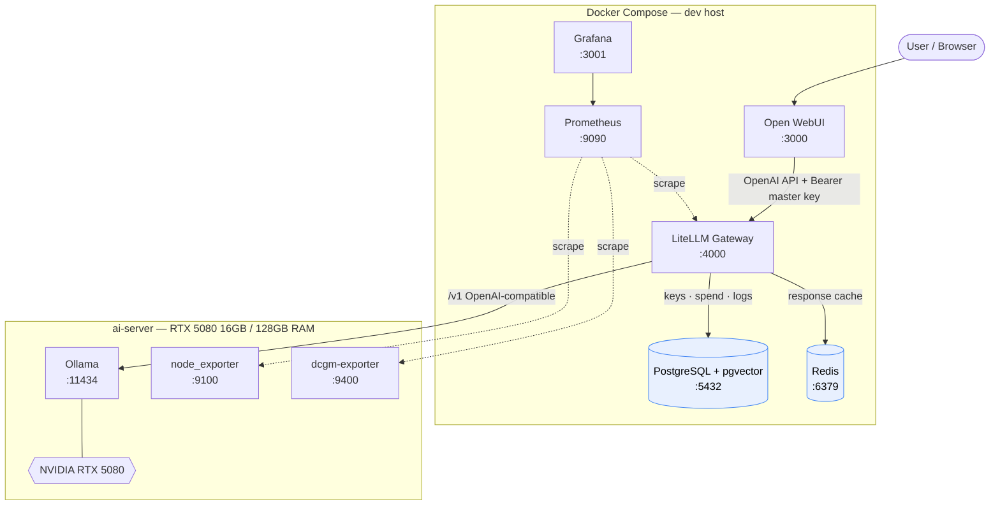

# Project 1 — Basic AI Platform

> Month 1 of the [learning plan](../Learn_Labs_Plan.md). A self-hosted AI platform
> that fronts an existing local model server with a **governed gateway**, a chat
> UI, vector-capable storage, response caching, and full **observability** (app +
> host + GPU).

Users only ever touch the chat UI; every model call is funnelled through a single
OpenAI-compatible gateway where auth, caching, logging, and (later) cost controls
live. The model server is treated as an internal "Bedrock equivalent" and is **not**
part of this stack — the platform *consumes* it.

Run with Docker Compose first to learn the stack end-to-end, then port to
Kubernetes / GitOps (ArgoCD) on Talos.

## Architecture



### Request flow

1. A user signs into **Open WebUI** (session signed with `WEBUI_SECRET_KEY`).
2. Open WebUI calls **LiteLLM** using the OpenAI API, authenticating with the
   `LITELLM_MASTER_KEY` — it has no direct knowledge of the model server.
3. **LiteLLM** routes the request to **Ollama** on `ai-server` over the
   OpenAI-compatible `/v1` API, caching responses in **Redis** and writing keys,
   spend, and request logs to **PostgreSQL**.
4. **Prometheus** scrapes LiteLLM (gateway metrics), `node_exporter` (host), and
   `dcgm-exporter` (GPU); **Grafana** visualizes all three.

## Components

| Service | URL | Role |
|---|---|---|
| **Open WebUI** | http://localhost:3000 | Chat UI — the only user-facing entry point |
| **LiteLLM** | http://localhost:4000 | OpenAI-compatible gateway: routing, auth, caching, audit |
| **PostgreSQL + pgvector** | internal `:5432` | Keys, spend, request logs; vector store for RAG (Project 2) |
| **Redis** | internal `:6379` | LiteLLM response cache |
| **Prometheus** | http://localhost:9090 | Metrics scraping (app + host + GPU) |
| **Grafana** | http://localhost:3001 | Dashboards (default datasource pinned to `uid: prometheus`) |
| **Ollama** *(external)* | `ai-server:11434` | Model server on the RTX 5080 box — consumed, not managed here |

## Models

Exposed through the gateway (`litellm/config.yaml`). Names are gateway aliases;
they map to real Ollama models on `ai-server`.

| Gateway name | Backend model | Notes |
|---|---|---|
| `llama3` / `llama3.1` | llama3 / llama3.1:8b | 8B — fast, VRAM-resident |
| `gemma2` | gemma2:9b | 9B |
| `phi4` | phi4 | 14B |
| `qwen2.5` | qwen2.5:14b | 14B — strong general model |
| `coder` | qwen2.5-coder:14b | Coding |
| `deepseek-coder` | deepseek-coder-v2:16b | Coding (MoE) |
| `qwen3` | qwen3.6:latest | 36B MoE — partial RAM offload, slower |
| `embed-nomic` | nomic-embed-text | 768-dim embeddings (RAG default) |
| `embed-bge-m3` | bge-m3 | 1024-dim, hybrid (dense+sparse) |
| `embed-arctic2` | snowflake-arctic-embed2 | 1024-dim, benchmark contender |

> `kimi-k2` (cloud-proxied) is present but commented out — it needs `ollama signin`
> on `ai-server`. See the GPU sizing rationale in the learning notes: the RTX 5080's
> 16 GB fits ≤14B models fast; the 36B `qwen3` runs via CPU/RAM offload (hence slow).

## Quick start

```bash
cd project-1-basic-ai-platform
cp .env.example .env
```

Edit `.env`:
- `LOCAL_AI_BASE_URL` → your Ollama endpoint, e.g. `http://<ai-server>:11434/v1`
- `AI_SERVER_IP` → the AI server's IP/host (used by Prometheus to scrape exporters)
- Generate each secret with `openssl rand -hex 32`

Bring it up and verify:

```bash
docker compose up -d
docker compose ps
./scripts/smoke-test.sh        # exercises every model + cache + UI + metrics
```

Open **http://localhost:3000**, create the first (admin) account, pick a model
(start with `llama3`), and chat. If a model is missing, confirm the names in
`litellm/config.yaml` match what `ai-server` actually serves
(`curl http://<ai-server>:11434/api/tags`).

## Observability

- **Grafana** → http://localhost:3001 → folder **AI Platform** →
  **"LiteLLM — AI Gateway Overview"**. Panels: request rate, token throughput,
  p95 latency (model vs gateway overhead), cache hit ratio, plus **GPU** (VRAM vs
  the 16 GB ceiling, utilization, temp, power) and **host** (CPU, memory, disk).
- **Host + GPU metrics** require `node_exporter` and `dcgm-exporter` running on
  `ai-server` — see [`docs/ai-server-monitoring.md`](docs/ai-server-monitoring.md).
- Check scrape health at http://localhost:9090/targets — `litellm`,
  `node-ai-server`, and `dcgm-ai-server` should all be **up**.

Tip: load `qwen3` in Open WebUI and watch the VRAM gauge climb toward 16 GB — you
can *see* the model spill from GPU to RAM, right next to the latency panel.

## Repository layout

```
project-1-basic-ai-platform/
├── docker-compose.yml          all services + the aiplat network
├── .env.example                config template (copy to .env, gitignored)
├── litellm/config.yaml         gateway: model routing, Redis cache, Postgres, metrics
├── postgres/init/01-init.sql   creates litellm/openwebui/knowledge DBs + pgvector
├── prometheus/prometheus.yml   scrape jobs: litellm, node-ai-server, dcgm-ai-server
├── grafana/provisioning/       datasource (pinned uid) + auto-loaded dashboard
├── scripts/smoke-test.sh       end-to-end verification through the gateway
└── docs/ai-server-monitoring.md  install node_exporter + dcgm-exporter on ai-server
```

## Configuration notes

- **Secrets** live only in `.env` (gitignored, `chmod 600`). `LITELLM_SALT_KEY`
  encrypts stored provider keys — set once, never rotate.
- **AI server address** is kept out of committed files: `prometheus.yml` scrapes
  the hostname `ai-server`, which the Prometheus container resolves via
  `extra_hosts: ["ai-server:${AI_SERVER_IP}"]` from `.env`.
- **Adding a model:** pull it on `ai-server` (`ollama pull <name>`), add a
  `model_list` entry in `litellm/config.yaml`, then `docker compose restart litellm`.

## Security model

- LiteLLM is the **single trust boundary**: Ollama has no auth, so the gateway is
  where authentication, audit logging, and cost control are enforced.
- Only Open WebUI (`:3000`) and the dashboards are meant for users; the data
  stores (`:5432`, `:6379`) stay on the internal `aiplat` network.
- Prometheus exporters serve unauthenticated metrics — keep `:9100`/`:9400`
  firewalled to the monitoring host (see the monitoring doc).

## Roadmap

- [x] Gateway + UI + Postgres/pgvector + Redis on Compose
- [x] App, host, and GPU observability (Prometheus + Grafana)
- [ ] Per-user LiteLLM API keys + budgets (governance foundation → Project 4)
- [ ] RAG ingestion into pgvector (→ Project 2)
- [ ] Port to Kubernetes manifests + ArgoCD on Talos (GitOps)
