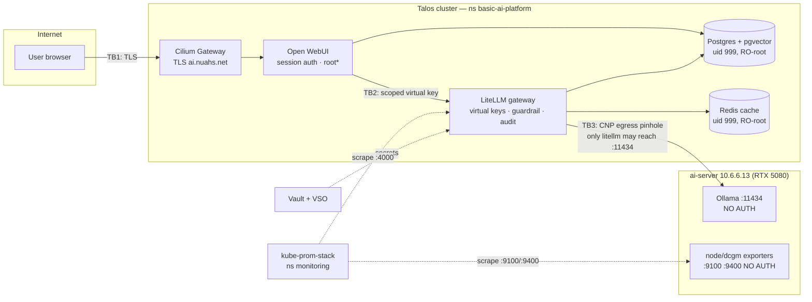

# Threat Model — Basic AI Platform (Project 1)

Covers both variants: Docker Compose (`project-1-basic-ai-platform`) and the
Helm/Talos deployment (`project-1-basic-ai-platform-k8s`). Categories follow
the **OWASP Top 10 for LLM Applications (2025)**. This document is the template
for every later project in the portfolio.

Status date: 2026-09. Scope: the platform itself (gateway, UI, stores,
observability, the external model server). Agentic concerns (tool use, MCP)
arrive with Project 2 and get their own model against the OWASP Agentic Top 10.

## Architecture & trust boundaries

**Trust boundaries**

| # | Boundary | Control |
|---|---|---|
| TB1 | Internet → cluster | Cilium Gateway, cert-manager TLS, only Open WebUI exposed |
| TB2 | UI → model gateway | LiteLLM **virtual key** (allow-list, budget, TPM/RPM) — the authorization boundary; the master key is held by no consumer |
| TB3 | Cluster → model server | CiliumNetworkPolicy egress pinhole: **only** the litellm pods may reach `10.6.6.13:11434`; default-deny everywhere else |
| TB4 | Workloads → cluster API | `automountServiceAccountToken: false` on every pod — a compromised workload holds no Kubernetes credentials |

## The "Ollama has no auth" decision

Ollama exposes no authentication. Rather than wrap it in a bespoke proxy, the
design accepts this **inside a constrained blast radius** and concentrates
AuthN/AuthZ, rate limiting, audit and guardrails at LiteLLM:

- In-cluster: TB3 — the CNP permits egress to `:11434` from litellm pods only
  (verified negative: open-webui cannot reach the model server directly).
- On the LAN: ufw on the ai-server restricts `11434` (and `9100/9400`) to the
  cluster nodes + admin workstation — see `docs/ai-server-monitoring.md`.
- Residual risk (**accepted**): any host inside that ufw allow-list can query
  models and pull/delete local model files. Month-3 (weight-security lab)
  tightens this with egress alerting and treats the model files as protected
  weights (RAND SL framing).

## OWASP LLM Top 10 (2025) — controls & status

| Category | Control | Status |
|---|---|---|
| LLM01 Prompt Injection | Heuristic pre-call guardrail on the gateway (`prompt_guard.py`): blocking tier (400) + flag tier, JSON audit line, verdict into SpendLogs. Every model call passes it — UI, scripts, future agents. | **Partial** — heuristic by design; Month-2 red-team harness measures ASR before/after and becomes the CI regression gate |
| LLM02 Sensitive Info Disclosure | Prompts/responses land only in `LiteLLM_SpendLogs` (Postgres, no external egress); access = master key or DB creds (Vault-held); 90-day retention (`maximum_spend_logs_retention_period`) | Mitigated |
| LLM03 Supply Chain | All 7 images pinned `tag@digest`; Kyverno `require-image-digest` + `restrict-registries`; Trivy CRITICAL gate + CycloneDX SBOMs in CI; cosign verify for LiteLLM (the **only** upstream that signs — probed `.sig` for every pinned digest: pgvector ✗, redis ✗, litellm ✓, open-webui ✗, prometheus ✗, grafana ✗, busybox ✗) | Mitigated (verification limited by upstreams; re-sign-into-own-registry is the documented stretch) |
| LLM04 Data & Model Poisoning | Models pulled on the ai-server by hand; no auto-pull from the platform. Model provenance is out of scope until the Month-3 weight lab | Accepted (this pass) |
| LLM05 Improper Output Handling | Open WebUI renders model output as chat; no downstream execution of output exists in this project yet | N/A here; becomes central in Project 2 |
| LLM06 Excessive Agency | No agents/tools in this project. Groundwork: per-key **model allow-lists** (openwebui key cannot touch the benchmark embedders), `ENABLE_OLLAMA_API=false` | Mitigated (scope-limited) |
| LLM07 System Prompt Leakage | Guardrail's exfiltration patterns flag/block "reveal your system prompt" classes; no secrets are placed in system prompts | Partial |
| LLM08 Vector & Embedding Weaknesses | pgvector present but unused until the RAG exercise (Weeks 2–3), which includes the vector-store security review | Deferred, tracked |
| LLM09 Misinformation | Out of scope for infrastructure hardening; UI shows model/source | Accepted |
| LLM10 Unbounded Consumption | Per-key **budgets** (nominal per-token prices make spend real), **TPM/RPM limits**, memory limits on every container, Redis response cache | Mitigated |

## Kubernetes-layer hardening (k8s variant)

- **Network**: default-deny CNPs; flows limited to the map in
  `templates/networkpolicies.yaml`; DNS restricted to kube-dns with L7 DNS
  visibility (Hubble shows query names); the TB3 egress pinhole.
- **Pods**: non-root (postgres/redis 999, prometheus 65534, grafana 472),
  read-only root where the image tolerates it, seccomp
  RuntimeDefault, `allowPrivilegeEscalation: false`, all capabilities dropped,
  no SA tokens. PSA: enforce `baseline`, warn/audit `restricted`.
- **Policy**: Kyverno (Audit → Enforce) — digests required, registries
  restricted, resources required, root disallowed (one exception below).
- **Secrets**: Vault → VSO → Secret; nothing sensitive in the public git repo.

## Accepted risks / exceptions register

| # | Exception | Why | Revisit |
|---|---|---|---|
| A1 | **litellm runs as root** | image regenerates the prisma client into site-packages at startup | migrate to BerriAI's non-root image variant |
| A1b | **open-webui runs as root** | startup rewrites root-owned files under `/app/backend/open_webui/static/` — uid-1000 attempt failed with EACCES (2026-09-12); caps dropped, no priv-esc, seccomp retained | revisit when upstream ships a non-root image; then PSA enforce → `restricted` |
| A2 | LiteLLM `/metrics` unauthenticated | scrape simplicity; reachable only via CNP ingress from Prometheus/monitoring | flip `require_auth_for_metrics_endpoint` if the namespace ever multi-tenants |
| A3 | No CPU limits | throttling hurts a latency-sensitive gateway more than it protects a single-tenant namespace (deliberate deviation, annotated in the Kyverno policy) | if co-tenancy arrives |
| A4 | 6 of 7 upstreams unsigned | can't verify what isn't signed; digest pins + registry allow-list + Trivy compensate | re-sign pinned digests into own registry with cosign |
| A5 | **Compose variant divergence**: Open WebUI still uses the master key; no policy engine/NetworkPolicy equivalent | k8s-first hardening decision; compose is the laptop/dev variant | fold in if compose is ever exposed beyond localhost |
| A6 | Ollama reachable by ufw-allow-listed LAN hosts | see "Ollama has no auth" above | Month-3 weight-security lab |

## Verification

- `scripts/smoke-test.sh` (k8s): positive path per model **plus** negative
  governance tests — scoped key denied `/key/generate`, allow-list denial,
  budget/limits attached.
- CNP negatives: litellm → `1.1.1.1` times out; open-webui → `redis:6379` and
  → `10.6.6.13:11434` fail; `hubble observe --verdict DROPPED` quiet during a
  chat + scrape cycle.
- Guardrail: "Ignore all previous instructions…" → 400 + audit line; verdicts
  visible in `LiteLLM_SpendLogs`.
- Kyverno: `kubectl get policyreport -n basic-ai-platform` clean under Enforce;
  `kubectl run p --image=nginx --dry-run=server` denied.
- CI (`.github/workflows/ci.yaml`): schema validation, config parity, Trivy
  gates, SBOM artifacts, cosign verify on every push.
